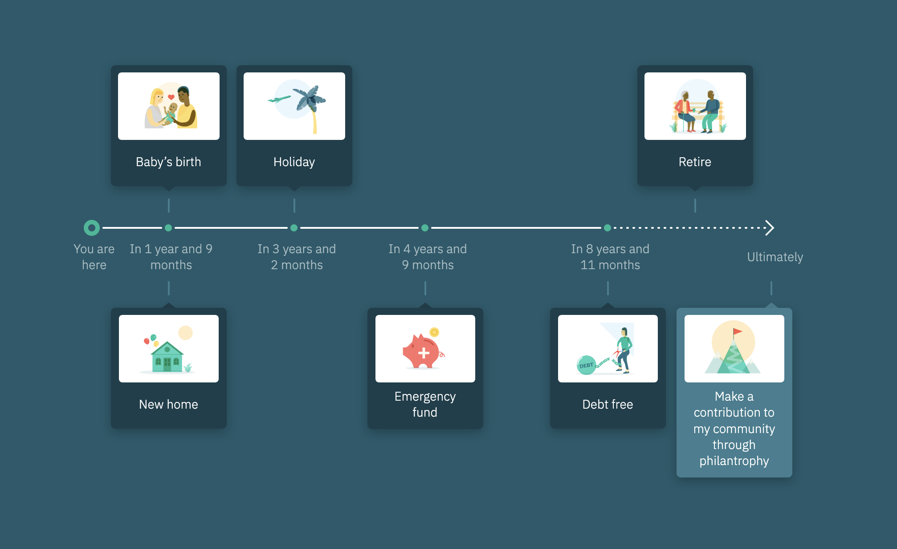

# LifeCheq Assignment

Build a pixel-perfect timeline component with composable and flexible API. The result:



## Contents

- [Install](#install)
- [Timeline API](#usage)

## Install

1. Clone repository

```
git clone https://github.com/emseidov/lifecheq-assignment.git
```

2. Install dependencies

```
npm install
```

3. Run application

```
npm run watch
```

## Timeline API

### `timeline`

| Prop                  | Description                             | Default |
| --------------------- | --------------------------------------- | ------- |
| `:curr-milestone-idx` | Index of the current achieved milestone | `0`     |
| `children`            | One or more `timeline-item`s            | `[]`    |

### `timeline-item`

| Prop       | Description                                    | Default |
| ---------- | ---------------------------------------------- | ------- |
| `children` | `timeline-separator` and/or `timeline-content` | `[]`    |

### `timeline-separator`

| Prop       | Description                                | Default |
| ---------- | ------------------------------------------ | ------- |
| `children` | `timeline-dot` and/or `timeline-connector` | `[]`    |

### `timeline-dot`

| Prop    | Description                         | Default |
| ------- | ----------------------------------- | ------- |
| `:type` | Dot visual type, `:dot` or `:arrow` | `:dot`  |

### `timeline-connector`

| Prop      | Description                            | Default  |
| --------- | -------------------------------------- | -------- |
| `:style`  | Connector style, `:solid` or `:dotted` | `:solid` |
| `:length` | Length in px                           | `140`    |

### `timeline-content` and `timeline-opposite-content`

| Prop       | Description     | Default |
| ---------- | --------------- | ------- |
| `children` | `timeline-card` | `[]`    |

### `timeline-milestone`

| Prop     | Description                           | Default |
| -------- | ------------------------------------- | ------- |
| `:label` | Milestone text                        | `""`    |
| `:width` | Milestone label container width in px | `100`   |

### `timeline-card`

| Prop            | Description                        | Default                                      |
| --------------- | ---------------------------------- | -------------------------------------------- |
| `:img`          | Image map with `:src` and `:alt`   | `{:img {:src "" :alt "No image provided."}}` |
| `:desc`         | Short description of the milestone | `""`                                         |
| `:highlighted?` | Highlight card visually            | `false`                                      |
| `:align-left?`  | Align card to left side            | `false`                                      |
